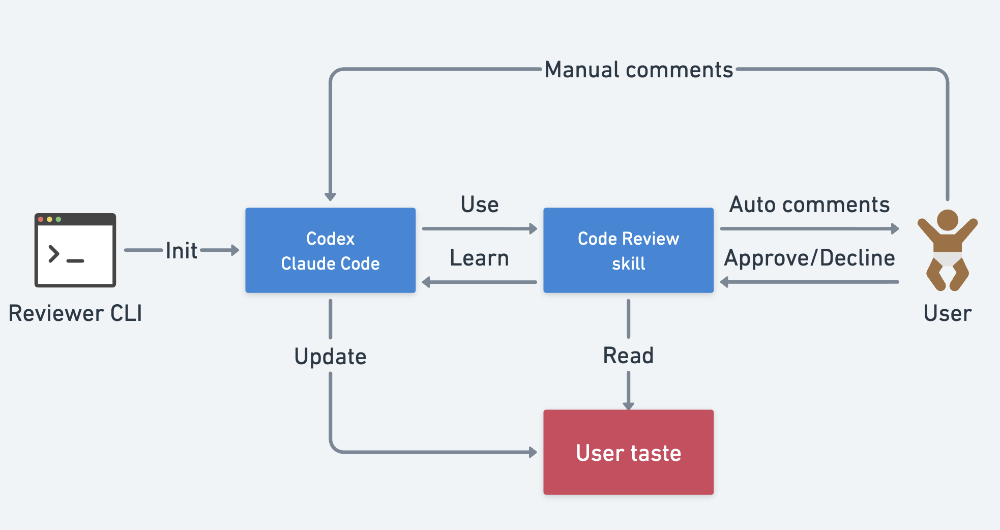

# reviewer

Automate mundane parts of code review. Speed up your workflow with LLM.

## Features

- List PRs needing your attention across multiple repositories
- Approve PRs or add comments without leaving the terminal
- Add line-level comments directly from the diff view
- Enhanced diff rendering with [delta](https://github.com/dandavison/delta) (side-by-side, syntax highlighting)
- Launch [Codex CLI](https://github.com/openai/codex) or [Claude Code](https://github.com/anthropics/claude-code) for AI-assisted reviews
- Background daemon mode that auto-triggers review on newly opened PRs (no retrigger on updates)
- Continuously learn from your feedback to improve AI accuracy

## Installation

### Homebrew (macOS)

```bash
brew tap daulet/tap
brew install reviewer
```

### From releases

Download the latest binary from [Releases](https://github.com/daulet/reviewer/releases).

### From source

```bash
cargo install --git https://github.com/daulet/reviewer
```

## Setup

### Required

- [GitHub CLI](https://cli.github.com/) (`gh`) - authenticated with `gh auth login`

### Optional

| Tool | Purpose | Install |
|------|---------|---------|
| [delta](https://github.com/dandavison/delta) | Enhanced diff rendering (side-by-side, syntax highlighting) | `brew install git-delta` |
| [Codex CLI](https://github.com/openai/codex) | AI-assisted code reviews (OpenAI) | `npm install -g @openai/codex` |
| [Claude Code](https://github.com/anthropics/claude-code) | AI-assisted code reviews | `npm install -g @anthropic-ai/claude-code` |

The diff view automatically detects if delta is installed and uses it for rendering. Otherwise, falls back to built-in syntax highlighting.

## Usage

```bash
reviewer                       # Scan configured directory
reviewer --my                  # Show PRs you authored (same as -m)
reviewer -r ~/dev              # Specify repos directory
reviewer -d                    # Include draft PRs
reviewer -e archived -e old    # Exclude directories
reviewer -e vendor --save-exclude  # Save exclusions to config

reviewer daemon init           # First-time daemon setup (repo checkbox selector)
reviewer daemon run            # Start daemon polling loop
reviewer daemon run --once     # Run one poll cycle and exit
reviewer daemon status         # Show daemon state/counters
```

On first run, you'll be prompted to set your repos root directory.

Use `--my` (or `-m`) to switch to "my PRs" mode. In this mode, reviewer
shows PRs authored by your GitHub account and enables `m` in detail view to
merge mergeable PRs with squash.

Daemon notes:
- On first daemon setup, reviewer shows an interactive checkbox list of repos and saves exclusions by `owner/repo`.
- Existing open PRs are seeded as already seen during init, so only newly opened PRs trigger.
- PR updates do not retrigger review; tracking is persisted in `~/.config/reviewer/daemon_state.json`.

### Keybindings

**List view:**
| Key | Action |
|-----|--------|
| `j/k` | Navigate |
| `Ctrl+d/u` | Page down/up |
| `g/G` | First/last |
| `Enter` | Open PR details |
| `/` | Search PRs |
| `n/N` | Next/previous search match |
| `o` | Open in browser |
| `y` | Copy PR URL |
| `R` | Refresh |
| `d` | Toggle drafts |
| `q` | Quit |

**Detail view:**
| Key | Action |
|-----|--------|
| `Tab` | Switch tabs (Description/Diff/Comments) |
| `j/k` | Scroll |
| `Ctrl+d/u` | Page down/up |
| `/` | Search in diff |
| `:` | Go to line number |
| `n/N` | Next/previous search match |
| `c` | Add line comment (in Diff tab) |
| `r` | Launch AI review |
| `a` | Approve |
| `x` | Close PR with comment |
| `m` | Merge PR (squash, `--my` mode only) |
| `o` | Open in browser |
| `y` | Copy PR URL |
| `p` | Previous PR |
| `q` | Back to list |

## AI Code Review Integration

For AI-assisted reviews, set up a code-review skill and pick a provider.

### 1. Install the skill

We keep a single skill definition under `.claude/skills/code-review/SKILL.md` and reuse it
for both providers. This repo includes `.codex/skills/code-review/SKILL.md`, so Codex will
pick it up when you run Codex from the repo root. If you prefer a global install, copy it
into `~/.codex/skills`:

```bash
mkdir -p ~/.claude/skills/code-review
cp .claude/skills/code-review/SKILL.md ~/.claude/skills/code-review/

mkdir -p ~/.codex/skills/code-review
cp .claude/skills/code-review/SKILL.md ~/.codex/skills/code-review/
```

Restart Codex after adding skills. In a Codex session, run `/skills` to confirm the
`code-review` skill is available, then invoke it with `$code-review`.
Note: Reviewer launches the AI tool from the PR worktree, so repo-local `.codex/skills`
in this repo won't be visible to Codex unless you install the skill globally.

### 2. Configure provider permissions (optional)

**Claude Code**

Add to `~/.claude/settings.json`:

```json
{
  "permissions": {
    "allow": [
      "Read(path:~/.config/reviewer/**)"
    ]
  },
  "sandbox": {
    "excludedCommands": ["gh"]
  }
}
```

**Codex CLI**

This repo includes `.codex/config.toml` and `.codex/rules/reviewer.rules` with conservative
defaults and allowlists for common review commands. If you want global defaults, mirror
them in `~/.codex/config.toml` and `~/.codex/rules`.

```toml
approval_policy = "on-request"
sandbox_mode = "workspace-write"
```

Create `~/.codex/rules/reviewer.rules`:

```
prefix_rule(
  pattern = ["gh", "pr", ["view", "comment", "review"]],
  decision = "allow",
)

prefix_rule(
  pattern = ["gh", "api"],
  decision = "allow",
)

prefix_rule(
  pattern = ["gh", "repo", "view"],
  decision = "allow",
)

prefix_rule(
  pattern = ["git", ["diff", "merge-base", "rev-parse"]],
  decision = "allow",
)
```

### 3. Customize review guidelines (optional)

Create `~/.config/reviewer/review_guide.md` to customize what the AI looks for:

```markdown
## Focus Areas
- Security vulnerabilities
- Performance issues
- Error handling

## Skip These
- Unused imports
- Minor style issues
```

The AI learns from skipped comments and offers to update this file automatically.

## Configuration

Config is stored at:
- macOS/Linux: `~/.config/reviewer/config.json`
- Windows: `%APPDATA%\reviewer\config.json`

AI settings are optional. `prompt_template` supports `{pr_number}`, `{repo}`, `{title}`,
`{review_guide}`, and `{skill}` placeholders.
On macOS/Linux, `terminal_app` lets you pick which terminal launches AI reviews (default: Terminal on macOS).
Daemon state is stored separately in:
- macOS/Linux: `~/.config/reviewer/daemon_state.json`
- Windows: `%APPDATA%\reviewer\daemon_state.json`

```json
{
  "repos_root": "/path/to/your/repos",
  "exclude": ["archived", "vendor"],
  "daemon": {
    "poll_interval_sec": 60,
    "exclude_repos": ["org/legacy-repo"],
    "initialized": true,
    "include_drafts": false
  },
  "ai": {
    "provider": "codex",
    "command": "codex",
    "args": [],
    "skill": "code-review",
    "prompt_template": "Review PR #{pr_number} in {repo}. Title: \"{title}\". Use {skill}. Follow {review_guide}",
    "terminal_app": "Ghostty"
  }
}
```

## License

MIT
