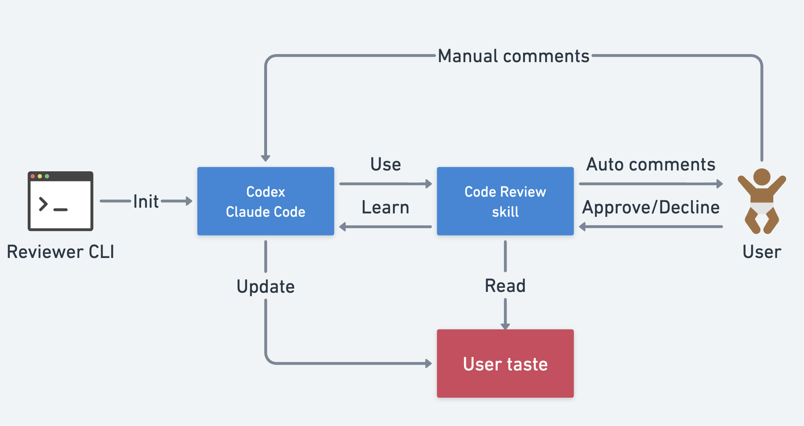

# reviewer

How do you keep up with AI generated PRs? Answer: use AI assisted code reviews.


## Features

- List, comment, approve PRs from your cloned repos;
- Start interactive AI assisted review session, let it learn your code review approach;  
- Run reviewer as daemon to kick off reviews as they are created;

## Installation

```bash
# Homebrew (macOS)
brew tap daulet/tap
brew install reviewer

# From source
cargo install --git https://github.com/daulet/reviewer
```

## Setup

### Required

- [GitHub CLI](https://cli.github.com/) (`gh`) - authenticated with `gh auth login`

### Optional

| Tool | Purpose | Install |
|------|---------|---------|
| [delta](https://github.com/dandavison/delta) | Enhanced diff rendering (side-by-side, syntax highlighting) | `brew install git-delta` |
| [Codex CLI](https://github.com/openai/codex) | AI-assisted code reviews (OpenAI) | `npm install -g @openai/codex` |
| [Claude Code](https://github.com/anthropics/claude-code) | AI-assisted code reviews | `npm install -g @anthropic-ai/claude-code` |
| [Maestro](https://github.com/daulet/maestro) | Launch review sessions in managed tmux sessions | `brew install daulet/tap/maestro` |

The diff tries to use `delta` if installed. Choice of code reviewer tool can be configured in `~/.config/reviewer/config.json`.

## AI Code Review Setup

For AI-assisted reviews, set up a code-review skill and pick a provider.

### 1. Install the skill

We keep a single skill definition under `.claude/skills/code-review/SKILL.md` and reuse it
for both providers. This repo includes `.codex/skills/code-review/SKILL.md`, so Codex will
pick it up when you run Codex from the repo root. If you prefer a global install, copy it
into `~/.codex/skills`:

```bash
mkdir -p ~/.claude/skills/code-review
cp .claude/skills/code-review/SKILL.md ~/.claude/skills/code-review/

mkdir -p ~/.codex/skills/code-review
cp .claude/skills/code-review/SKILL.md ~/.codex/skills/code-review/
```

Restart Codex after adding skills. In a Codex session, run `/skills` to confirm the
`code-review` skill is available, then invoke it with `$code-review`.
Note: Reviewer launches the AI tool from the PR worktree, so repo-local `.codex/skills`
in this repo won't be visible to Codex unless you install the skill globally.

### 2. Configure provider permissions (optional)

**Claude Code**

Add to `~/.claude/settings.json`:

```json
{
  "permissions": {
    "allow": [
      "Read(path:~/.config/reviewer/**)"
    ]
  },
  "sandbox": {
    "excludedCommands": ["gh"]
  }
}
```

**Codex CLI**

This repo includes `.codex/config.toml` and `.codex/rules/reviewer.rules` with conservative
defaults and allowlists for common review commands. If you want global defaults, mirror
them in `~/.codex/config.toml` and `~/.codex/rules`.

```
prefix_rule(
  pattern = ["gh", "pr", ["view", "comment", "review"]],
  decision = "allow",
)

prefix_rule(
  pattern = ["gh", "api"],
  decision = "allow",
)

prefix_rule(
  pattern = ["gh", "repo", "view"],
  decision = "allow",
)

prefix_rule(
  pattern = ["git", ["diff", "merge-base", "rev-parse"]],
  decision = "allow",
)
```

### 3. Customize review guidelines (optional)

Create `~/.config/reviewer/review_guide.md` to customize what the AI looks for:

```markdown
## Focus Areas
- Security vulnerabilities
- Performance issues
- Error handling

## Skip These
- Unused imports
- Minor style issues
```

The AI learns from skipped comments and offers to update this file automatically.

## Usage

```bash
reviewer                       # Scan configured directory
reviewer -d                    # Include draft PRs
reviewer -r ~/dev              # Specify repos directory
reviewer -e archived -e old    # Exclude directories

reviewer --my                  # Show PRs you authored (same as -m)
reviewer trigger --repo org/repo --pr 1234
reviewer trigger --repo-path ~/dev/org-repo --pr 1234

reviewer daemon init           # Pick repos to monitor
reviewer daemon run            # Start daemon polling loop
reviewer daemon status         # Show daemon state/counters
```

On first run, you'll be prompted to set your repos root directory.

Use `--my` (or `-m`) to switch to "my PRs" mode. In this mode, reviewer
shows PRs authored by your GitHub account and enables `m` in detail view to
merge mergeable PRs with squash.

`reviewer trigger` launches a review session for an explicit PR and bypasses
the list-mode draft/approved filters.

Daemon notes:
- On first daemon setup, reviewer shows an interactive checkbox list of repos and saves exclusions by `owner/repo`.
- In daemon init UI, press `f` on a selected repo to open a subdirectory tree popup.
  Use `j/k` (or arrows) to move, `Enter` to expand/collapse, and `Space` to mark paths.
- Existing open PRs are seeded as already seen during init, so only newly opened PRs trigger.
- PR updates do not retrigger review; tracking is persisted in `~/.config/reviewer/daemon_state.json`.
- Failed launches are retried on subsequent polls until they succeed.
- Long-running daemon processes auto-restart after binary upgrades (detected on poll boundaries).
- Optional `daemon.repo_subpath_filters` lets you restrict a repo to PRs touching specific subpaths.
  Omit a repo (or set an empty list) to monitor all PRs in that repo.
- Optional `daemon.auto_approve` rules auto-approve PRs when both repo and author match.
  Matching is case-insensitive, supports `*` (any sequence) and `?` (single character),
  and applies only to non-self-review daemon triggers.
- Optional `daemon.only_new_prs_on_start` controls first-run behavior:
  when `true` (default), daemon init seeds currently open PRs as seen so only PRs opened
  after first launch are processed. Later restarts still process PRs opened while daemon was down.
- Daemon also triggers self-reviews for PRs authored by your account (non-drafts only).
  Set `ai.launch.self_review_steps` to customize launch commands for those sessions.

## Terminal Launch Harness (macOS)

Testing-only utility to validate terminal launch behavior (tab/window/session execution).

```bash
reviewer harness --terminal-app Ghostty --terminal-launch-mode same-space --runs 3
reviewer harness --terminal-app Ghostty --terminal-launch-mode new-tab --runs 3
```

## Configuration

Config is stored at:
- macOS/Linux: `~/.config/reviewer/config.json`
- Windows: `%APPDATA%\reviewer\config.json`
Unknown fields are rejected on startup (for example, config key typos).

AI settings are optional. `prompt_template` supports `{pr_number}`, `{repo}`, `{title}`,
`{review_guide}`, and `{skill}` placeholders.
Review launching is configured via `ai.launch.steps`, an ordered list of commands.
Each step runs with the PR worktree as cwd. Common placeholders:
- `{workdir}`, `{workdir_shell}`
- `{repo}`, `{repo_slug}`, `{pr_number}`, `{title}`
- `{prompt}`, `{review_guide}`
- `{tool}` (AI CLI binary), `{tool_command}` (shell-escaped full invocation with prompt)
- `{session_title}`, `{timestamp_ms}`
- `{provider}`, `{skill_name}`, `{skill_invocation}`

Reviewer no longer has built-in launcher presets; define launcher behavior in config.
Daemon state is stored separately in:
- macOS/Linux: `~/.config/reviewer/daemon_state.json`
- Windows: `%APPDATA%\reviewer\daemon_state.json`

```json
{
  "repos_root": "/path/to/your/repos",
  "exclude": ["archived", "vendor"],
  "daemon": {
    "poll_interval_sec": 60,
    "exclude_repos": ["org/legacy-repo"],
    "repo_subpath_filters": {
      "org/monorepo": ["services/payments", "infra/terraform"],
      "org/full-repo": []
    },
    "auto_approve": [
      {"repo": "org/reviewer", "user": "dependabot[bot]"},
      {"repo": "org/*", "user": "*[bot]"},
      {"repo": "org/monorepo", "user": "renovate[bo?]"}
    ],
    "only_new_prs_on_start": true,
    "initialized": true,
    "include_drafts": false
  },
  "ai": {
    "provider": "codex",
    "command": "codex",
    "args": [],
    "skill": "code-review",
    "prompt_template": "Review PR #{pr_number} in {repo}. Title: \"{title}\". Use {skill}. Follow {review_guide}",
    "launch": {
      "steps": [
        {
          "command": "maestro",
          "args": [
            "start",
            "--cwd",
            "{workdir}",
            "--title",
            "review {repo}#{pr_number}",
            "--tag",
            "review",
            "--auto-approve",
            "--tool",
            "codex",
            "--cmd",
            "{tool_command}"
          ]
        }
      ],
      "self_review_steps": [
        {
          "command": "maestro",
          "args": [
            "start",
            "--cwd",
            "{workdir}",
            "--title",
            "self-review {repo}#{pr_number}",
            "--tag",
            "self-review",
            "--auto-approve",
            "--tool",
            "codex",
            "--cmd",
            "{tool_command}"
          ]
        }
      ]
    }
  }
}
```

Terminal.app (macOS, new window) launch example:

```json
{
  "ai": {
    "provider": "codex",
    "command": "codex",
    "launch": {
      "steps": [
        {
          "command": "osascript",
          "args": [
            "-e",
            "tell application \"Terminal\" to activate",
            "-e",
            "tell application \"Terminal\" to do script \"cd {workdir_shell} && exec {tool_command}\""
          ]
        }
      ]
    }
  }
}
```

Ghostty (macOS, new instance) launch example:

```json
{
  "ai": {
    "provider": "codex",
    "command": "codex",
    "launch": {
      "steps": [
        {
          "command": "open",
          "args": [
            "-na",
            "Ghostty",
            "--args",
            "-e",
            "bash",
            "-lc",
            "cd {workdir_shell} && exec {tool_command}"
          ]
        }
      ]
    }
  }
}
```

Linux terminal launch example (`gnome-terminal`):

```json
{
  "ai": {
    "provider": "codex",
    "command": "codex",
    "launch": {
      "steps": [
        {
          "command": "gnome-terminal",
          "args": [
            "--",
            "bash",
            "-lc",
            "cd {workdir_shell} && {tool_command}; exec bash"
          ]
        }
      ]
    }
  }
}
```

## License

MIT
